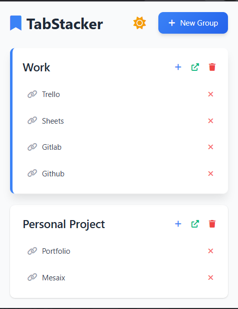
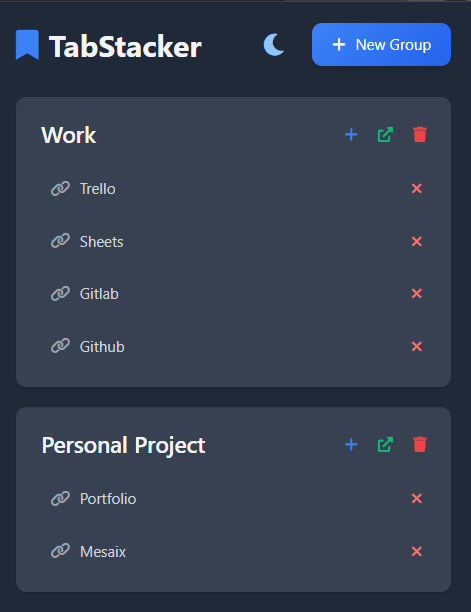

# TabStacker

<div align="center">
  
  <h3>Organize your bookmarks into custom collections</h3>
</div>


## Overview

TabStacker is a lightweight Chrome extension that helps you organize your online world by creating custom bookmark collections. Unlike traditional browser bookmarks, TabStacker lets you categorize websites into personalized groups for different projects, interests, or workflows.

## Features

- **Custom Bookmark Groups**: Create and manage distinct bookmark collections for different purposes
- **Quick Bookmarking**: Save the current page to any group with just a few clicks
- **Context Menu Integration**: Right-click on any page or link to quickly add it to TabStacker
- **Bulk Actions**: Open all links in a group with a single click
- **Clean UI**: Intuitive, user-friendly interface that's easy to navigate
- **Theme Support**: Choose between light and dark modes for comfortable browsing
- **Local Storage**: All data is stored locally on your device

## Screenshots

<div align="center">
  
  
</div>

## Installation

### From Chrome Web Store
1. Visit the [TabStacker page](https://chrome.google.com/webstore/detail/tabstacker/coming-soon) on the Chrome Web Store
2. Click "Add to Chrome"
3. Click the TabStacker icon in your browser toolbar to begin using it

### Manual Installation (Development)
1. Clone this repository or download the ZIP file and extract it
2. Open Chrome and navigate to `chrome://extensions/`
3. Enable "Developer mode" (toggle in the top-right corner)
4. Click "Load unpacked" and select the extension directory
5. The TabStacker icon should appear in your toolbar

## Usage

1. **Creating a Group**:
   - Click the TabStacker icon in your toolbar
   - Click "New Group" and enter a name

2. **Adding Bookmarks**:
   - Navigate to a webpage you want to bookmark
   - Click the TabStacker icon and then the "+" button next to the desired group
   - Edit the title if needed and click "Add"
   - Alternatively, right-click on any page or link and select "Add to TabStacker"

3. **Managing Bookmarks**:
   - Click on a bookmark to open it in a new tab
   - Click the "×" button next to a bookmark to remove it
   - Click the trash icon next to a group to delete the entire group

4. **Opening Multiple Bookmarks**:
   - Click the external link icon on a group to open all bookmarks in that group

5. **Theme Switching**:
   - Click the sun/moon icon to toggle between light and dark mode

## Planned Features

- [ ] Search functionality
- [ ] Drag and drop for reordering
- [ ] Nested groups/folders
- [ ] Tagging system
- [ ] Import/export capabilities
- [ ] Keyboard shortcuts
- [ ] Favicon support

## Contributing

Contributions are welcome! If you'd like to contribute:

1. Fork the repository
2. Create a new branch (`git checkout -b feature/amazing-feature`)
3. Make your changes
4. Commit your changes (`git commit -m 'Add some amazing feature'`)
5. Push to the branch (`git push origin feature/amazing-feature`)
6. Open a Pull Request

Please read [CONTRIBUTING.md](CONTRIBUTING.md) for details on our code of conduct and the process for submitting pull requests.

## Development

This extension is built with:
- HTML/CSS for the UI
- JavaScript for functionality
- Chrome Extension APIs for browser integration
- Tailwind CSS for styling

### Project Structure

```
tabstacker/
├── icons/             # Extension icons
├── screenshots/       # Screenshots for documentation
├── LICENSE            # LICENSE
├── README.md          # README file
├── background.js      # Background scripts
├── manifest.json      # Extension manifest
├── popup.html         # Main extension UI
└── popup.js           # UI functionality```

## Privacy

TabStacker stores all your bookmark data locally on your device using Chrome's storage API. No data is sent to external servers.

## License

This project is licensed under the MIT License - see the [LICENSE](LICENSE) file for details.

## Acknowledgments

- [Font Awesome](https://fontawesome.com/) for the icons
- [Tailwind CSS](https://tailwindcss.com/) for styling

---

<div align="center">
  <p>Made with ❤️ </p>
  <p>© 2025 TabStacker</p>
</div>
